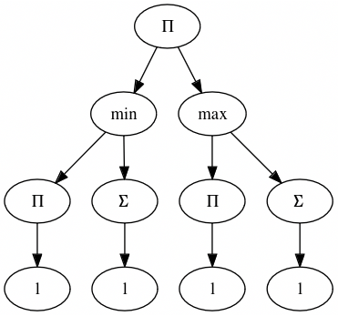
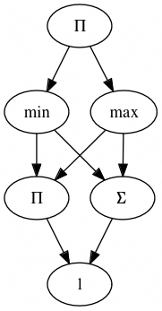
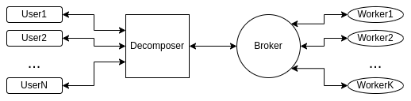
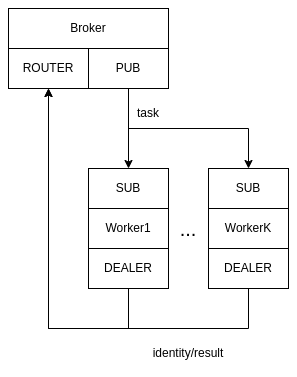

# Computational Task Decomposition and Dispatching in Distributed Context
## Description
This is a C++ 20 project that implements decomposition of user-defined task and distribute its calculation between workers. The system is asynchronous which allows to process multiple requests from users simultaneously. Another important property of the system is horizontal scalability. New workers can connect to network at runtime.

### Decomposition
A task is described as an abstract syntax tree that consists of operations and variables. A variable can be a number or a list of numbers. Decomposition stage optimizes the tree by illuminating duplicate subtrees with [Link Value-Number algorithm](https://en.wikipedia.org/wiki/Value_numbering) forming directed acyclic graph. Then topological sort is performed in order to define computation sequence. Node of DAG will later be referenced as "atomic operation".
<details><summary>Example</summary>
    <figure>
        
        <figcaption>Input AST</figcaption>
    </figure><br>
    <figure>
        
        <figcaption>Output DAG</figcaption>
    </figure>

</details>

### Dispatching
#### System Entities
- _User_ - gRPC client that sends task in form of AST and gets final result
- _Decomposer_ - gRPC async server that receives a task optimizes it and determines calculation order
- _Broker_ - intermediate node that abstracts away decomposer communication with workers
- _Worker_ - a machine that has a thread-pool which is used to compute multiple atomic tasks sent by Broker

#### High Level Communication Design


#### Implementation Details
##### User - Decomposer
Communication between user and decomposer is implemented as gRPC async client-server respectively with Callback API. User sends AST to decomposer and decomposer sends result when computation is finished.
##### Decomposer - Broker
Communication between decomposer and broker is implemented with ZeroMQ library. These nodes are stable in suggested network topology so they are connected via PAIR socket type. Read operation is non-blocking on both sides. Decomposer sends all atomic tasks that are _computable_ prioritizing them by user request order. Computable property is defined by topological sort. Broker sends tasks that were computed back to decomposer and decomposer updates computable property of DAG nodes.
##### Broker - Worker
Communication between Broker and Worker is implemented with two ZeroMQ socket pairs: PUB-SUB and ROUTER-DEALER. Broker is both PUB and ROUTER,  Worker is SUB and DEALER. Broker process starts before any of workers. Then workers connect to broker and send their identity name with number of cores available by DEALER socket. When Broker gets atomic task from decomposer it sends task to Worker with at least one free core by PUB socket. Broker is responsible for tracking workers' load. If all workers are busy Broker queues atomic tasks. Worker reads tasks from SUB socket and sends result by DEALER socket. Computation result is propagated to decomposer by broker. Read operations are non-blocking.  

##### Worker 
Worker implements thread-pool with allows to process multiple atomic tasks in parallel.

### Build and Run
#### Dependencies
- gRPC
- Protobuf
- ZeroMQ
- Boost Graph library
- spdlog
- SQLiteCPP
- nlohmann json 
#### Build
```
mkdir build
cd build
cmake ..
cmake --build .
```
#### Start System
All components are packed into docker containers and started by docker compose. To start the system only one command is required:
```
docker-compose up
```
Number of users can be scaled with the following command:
```
docker-compose up --scale client=<N>
```
#### Note
Project root has `start.sh` script that both builds and starts the system.

### Further Development
At the current state of the project atomic tasks and there results are not sent directly instead their ids are used. All intermediate results are stored on separate machine that uses SQLite. It was implemented this way in order to reduce IO load (Assuming that database is quick and optimized for worker's read-write operations). This data transition approach is reasonable but requires further optimization.